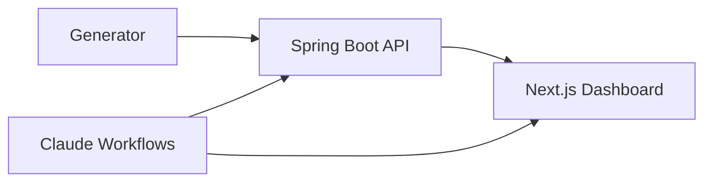

# Energy Market Intelligence

Agent-native wholesale power telemetry. Spring Boot API. Next.js 16 dashboard. Five deterministic ISO markets.



## Run locally

Requires **Node 26**, **pnpm 11**, Java 22+, Maven 3.9+.

```bash
# Terminal 1 — API
cd backend && mvn spring-boot:run

# Terminal 2 — Dashboard
cd frontend && corepack enable && pnpm install && pnpm dev
```

Open [http://localhost:3000](http://localhost:3000).

## Stack

| Layer | Technology |
| :-- | :-- |
| API | Java 22, Spring WebFlux, deterministic generator |
| Dashboard | Next.js 16, React 19, TanStack Query, Chart.js |
| Toolchain | Node 26, pnpm 11 |
| Agent platform | Claude Code workflows, skills, CI evals |
| Markets | CAISO, ERCOT, MISO, NEISO, PJM |

## Verify

```bash
cd backend && mvn test
cd frontend && pnpm run type-check && pnpm run test:ci && pnpm run build
```

MIT · [LICENSE](LICENSE)
