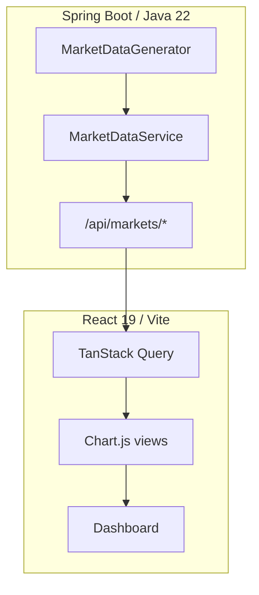

# Energy Market Visualization

Synthetic wholesale electricity telemetry for product and analytics experiments. A reactive Spring Boot API generates deterministic market data; a React dashboard renders price, demand, carbon, and forecast views without live ISO feeds.

## System architecture



## Markets covered

Deterministic synthetic series for five North American ISOs: **CAISO**, **ERCOT**, **MISO**, **NEISO**, **PJM**.

Each market exposes price, load, carbon intensity, renewable share, volatility metrics, and short-horizon forecast envelopes.

## API

| Endpoint | Description |
| --- | --- |
| `GET /api/markets/catalog` | Market metadata and regions |
| `GET /api/markets/overview` | Cross-market snapshot |
| `GET /api/markets/{code}/snapshot` | History, forecast, and insights for one market |

Query parameters control history window, resolution, and forecast horizon on snapshot requests.

## Quick start

**Backend**

```bash
cd backend
mvn spring-boot:run
```

**Frontend**

```bash
cd frontend
npm install
npm run dev    # http://localhost:3000
```

For split hosting, copy `frontend/.env.example` to `.env.local` and set `VITE_API_BASE_URL` to the API origin.

## Quality gates

```bash
cd backend && mvn spotless:apply test
cd frontend && npm run type-check && npm run lint && npm run test:ci && npm run build
```

Combined pre-commit script:

```bash
scripts/pre-commit-quality-check.sh
```

## Dashboard features

- Multi-market overview with price movement and sustainability metrics
- Configurable history and forecast windows per market
- Dual-axis price and demand chart
- Forecast table with confidence bounds
- Insights panel for volatility, demand statistics, and anomaly flags

## Prerequisites

Node.js 20+, npm 10+, Java 22+, Maven 3.9+.

## License

MIT. See [LICENSE](LICENSE).
